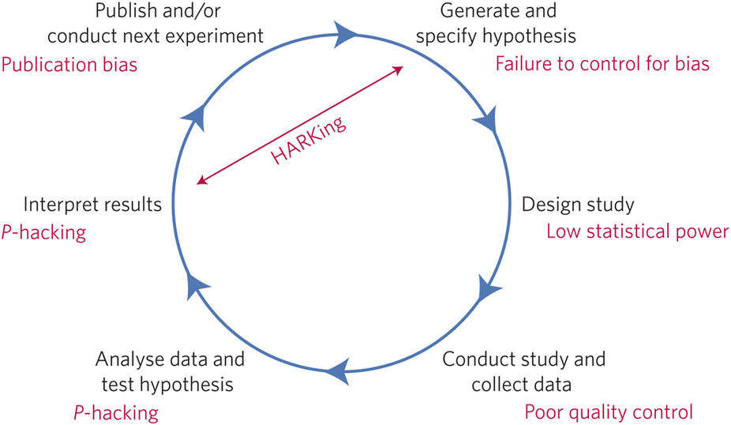

```{r setup, include=FALSE}
knitr::opts_chunk$set(echo = FALSE)
```

# <small> What we did last week... </small>

----

We looked at projects <br>
for mass collaboration

----

Then we looked at the <br>
preregistration process <br>
and registered reports

----

And we talked about tools <br>
for digital open scientists

----

Any questions or anything to add?

# <small>Last week's homework</small>

----

Who of you could take a look at  <br>
the experiments and surveys at <br>
<a href="https://expfactory.github.io/expfactory/">The Experiment Factory</a>?

----

Who found something interesting?

----

Who did not?

----

Any questions about <br>
the experiment factory?

# <small>Today:<br>Scientific pitfalls and how to avoid them</small>

----

The hypothetico-deductive model  
  
<small>Source: Munafo et al. (2017)</small>

----

## <small>Scientific pitfalls</small>

- Where do you see room for "problems"?  
- What kind of problems?  
- Please discuss with your neighbors.

----

The hypothetico-deductive model  
  
<small>Source: Munafo et al. (2017)</small>

----

The hypothetico-deductive model  
  
<small>Source: Munafo et al. (2017)</small>

----

## <small>Failure to control for bias</small>

- Humans are prone to <a href = "https://en.wikipedia.org/w/index.php?title=List_of_cognitive_biases">cognitive biases</a>
- Scientists are humans (too)
- Scientists are prone to cognitive biases (too)

----

## <small>Low statistical power</small>

- $\alpha$: The conditional probability of incorrectly <br>
  rejecting H0 when it actually is true.
- $\beta$: The conditional probability of failing <br>
  to reject H0 when it is false.
- Power: The complement of β (i.e. 1 - β), this is the <br>
  probability of correctly rejecting H0 when it is false.
- <a href="http://rpsychologist.com/d3/NHST/">Understanding Statistical Power <br>
  and Significance Testing</a>

----

## <small>Poor quality control</small>

- Risk of "noisy data"
- Leads to low power

----

## <small>p-hacking</small>

  
<small><a href = "https://imgs.xkcd.com/comics/p_values.png">"P-Values"</a> by <a href = "xkcd.com">xkcd.com</a> is licensed under <a href = "https://creativecommons.org/licenses/by-nc/2.5/">CC BY-NC 2.5</a></small>

----

## <small>p-hacking</small>

- Also called <a href = "https://en.wikipedia.org/wiki/Data_dredging">data dredging</a> is the<br>art of getting significant results
- <a href = "http://shinyapps.org/apps/p-hacker/">p-hacker: Train your p-hacking skills!</a>

----

## <small>Publication bias</small>

- Positive and novel studies are <br>
  more likely to be published
- Negative studies and replications <br>
  remain inside the scientists' drawers

----

## <small>HARKing</small>

- Hypothesizing After the Results are Known

# <small>Solutions</small>

----

## <small>A 21 word solution</small>  
“We report how we determined our <br>
sample size, all data exclusions <br>
(if any), all manipulations, and <br>
all measures in the study.”  
<small>Simmons et al. (2012)</small>

----

## <small>A manifesto for reproducible science</small>

<a href = "https://www.nature.com/articles/s41562-016-0021/tables/1"> Munafò et al.</a>

----

## <small>TOP Guidelines</small>

- TOP: Transparency and Openness Promotion
- Guidelines for journals 
- 4 levels of openness
- <a href = https://mfr.osf.io/render?url=https://osf.io/2cz65/?action=download%26mode=render>TOP Guidelines</a>

# <small>Any more questions?</small>

#
# <small>tl;dr</small>

----

<a href = "https://www.youtube.com/watch?v=42QuXLucH3Q">Is Most Published Research Wrong?</a>

# <small>Preview: next Saturday</small>

----

"Your personal open science project"

----

On Saturday at 12:30 p.m.

# <small>Homework</small>

----

If you haven't, take a look at <br>
<a href="https://expfactory.github.io/expfactory/">The Experiment Factory</a>

----

Collect questions regarding your research projects

# <small>Thank you for your attention</small>
